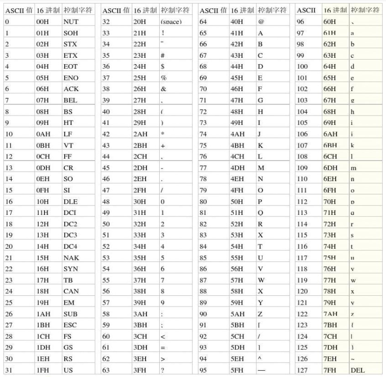

# 前导

一些关于字符编码的知识

<!-- more -->

# 字符集

众所周知，计算机不能直接存储字符，而是用数字来代替。字符集为每个字符指定一个数字。

## ASCII

其中最为著名就是ASCII。

它为英文字母、阿拉伯数组、标点符号等 128 个字符，每个都用一个 0 到 127 范围内的数字对应。

如果你想要表示一个字符，就在这个表里寻找到相应的数字编号，然后存这个编号即可。



比如以下的数字：

```plain&#x20;text
0x59 0x41 0x4E
```

按照ASCII字符集进行映射，得到的就是 `YAN` 。

## Unicode

而 Unicode 为世界上所有的字符都指定了一个映射，为了兼容ASCII，0\~127的映射都是ASCII字符。近五十万种各类符号，包括箭头、数学符号、表情符号、象形文字以及古代脚本，应有尽有。

在历经多年的发展之后，Unicode现在已有从 0x0 到 0x10FFFF 的字符映射。

> 虽然其中也有不少空号以便后续扩展

在网上也能找到 Unicode 的字符集：

[Unicode](https://symbl.cc/cn/unicode-table/)

# 字符编码

虽然 Unicode 只指定了字符和整数之间的相互映射，但是并没有规定这些整数怎么在内存中存储。

> 字符编码: 将字符的整数编号序列化为计算机可直接存储的一个或多个实际存在的整数类型。

Unicode 字符可以选用以下这些字符编码来序列化：

* UTF-32: 每个 Unicode 字符用 1 个 `uint32_t` 整数存储。

* UTF-16: 每个 Unicode 字符用 1 至 2 个 `uint16_t` 整数存储。

* UTF-8: 每个 Unicode 字符用 1 至 4 个 `uint8_t` 整数存储。

> 码点：指字符集中的每个字符所对应的唯一编号。
>
> 码位：编码后的最小存储单元。如在UTF-8中，码位就是 `uint8_t`

## UTF-32

Unicode 字符映射的整数范围是 0x0 到 0x10FFFF。

最大值 0x10FFFF 占 21 bit ，C 语言中 `uint32_t` 能容纳 32 个二进制位，所以最简单的方法是直接用 `uint32_t` 数组来一个个容纳 Unicode 字符。虽然浪费了 11 位，但至少所有 Unicode 字符都能安全容纳。

例如想要使用计算机来存储 “奶龙”：

```c++
std::vector<uint32_t> s = {
    0x00005976, // 奶
    0x00009F99  // 龙
};
```

在 UTF-32 中，每一个码点都只需要一个码位，是定长编码。

优点：

* 数组的长度，就是字符串中实际字符的个数。

* 要取出单个字符，可以直接用数组的索引操作。

* 无论对数组如何切片，都不会把一个独立的字符破坏。

* 反转数组，就可以把字符串反转，不会产生破坏字符的问题。

缺点：

* 浪费了空间（21位的字符用了32位的空间）

定长编码处理起来相当方便。因此，在内存中，推荐统一用 UTF-32 来表示单个字符。

## UTF-8

UTF-32 虽然方便了字符处理，但是它浪费了大量空间，不利于存储。并且有些字符的表示并不需要完整的 21 bit（如ASCII字符）。

> 世界上常用语言文字都被刻意编码在了 0 到 0xFFFF 区间内，超过 0x10000 的基本都是不常用的字符，例如甲骨文、埃及象形文字、Emoji、生僻字等，比如“𪚥”（四个繁体的龙）。因此，不能为了偶尔才使用的生僻字符，就要求所有字符都使用 32bit 的空间。

而很巧的是，Unicode 在设计的时候，就把常用的字符放在了靠前的位置。因此，UTF-8 这一变长编码就成为了存储字符串的最佳实践。

UTF-8 根据字符码点的范围，用不定数量的码位来表示字符：

* 0 到 0x7F 范围内的字符，用 1 个字节表示。

* 0x80 到 0x7FF 范围内的字符，用 2 个字节表示。

* 0x800 到 0xFFFF 范围内的字符，用 3 个字节表示。

* 0x10000 到 0x10FFFF 范围内的字符，用 4 个字节表示。

编码解码规则如下

### 兼容ASCII

对于 0 到 0x7F 的字符，这个范围的字符需要 7 位存储。

我们选择直接存储其值。

例如 ‘Z’ 会被直接存储其 Unicode 值的 90（0x5A）：

```plain&#x20;text
01011010
```

由于 Unicode 在 0 到 0x7F 范围内与 ASCII 表相同，而 UTF-8 又把 0 到 0x7F 的值直接存储，所以 UTF-8 兼容 ASCII。因此，所有设计用于 UTF-8 编码的字符或字符串工具，都能接收、处理 ASCII 文本。

但是反过来，原本设计用于ASCII的字符串或字符工具，不一定能够使用 UTF-8 字符编码的文本。（例如C语言的 `strlen` 处理 `"我们"` ，结果就不是 2 而是 6。）

### 非ASCII字符的编码与解码

UTF-8 的构造就像一列小火车一样，不同范围内的码位会被编码成不同长度的列车，但他们都有一个车头。

根据火车头（标识位）：

* 如果是 `0` 开头，就说明是单独一台火车头，后面没有车厢了，这表示车头里面直接装着 0 到 0x7F 范围的普通 ASCII 字符。

* 如果是 `110` 开头，就说明后面拖着一节车厢，里面装着 0x80 到 0x7FF 范围内的欧洲字符。该字符的有效载荷就是 5 + 6 == 11

* 如果是 `1110` 开头，就说明后面拖着两节车厢，里面装着 0x800 到 0xFFFF 范围内的世界常用字符。该字符的有效载荷就是 4 + 2 \* 6 == 16

* 如果是 `11110` 开头，就说明后面拖着三节车厢，里面装着 0x10000 到 0x10FFFF 范围内的生僻字符。该字符的有效载荷就是 3 + 3 \* 6 == 21

* 如果是 `10` 开头，就说明这是一节车厢，车厢不会单独出现，只会跟在火车头屁股后面。如果你看到一节单独的车厢在前面无头驾驶，就说明出错了。

### UTF-8的抗干扰能力

如果发现了 `10` 开头的车头，就说明出错。因为火车被错误截断或者其他原因， `10` 车厢成为了独立车头。此时，解码器就会用错误字符�（0xFFFD）替换

> 尤其在没有妥善处理 TCP 粘包问题的时候，导致火车头离开了缓冲区而车厢仍然滞留在缓冲区中，导致 UTF-8 解码出错。应该使用状态机进行解码

此外，如果发现了以下情况，也会报错：

* `11111` 开头：UTF-8要求最多以11110开头

* 浪费了空间：如“Δ”，只需2字节的UTF-8却用3字节的UTF-8承载

* 字符范围超过了 0x10FFFF

### UTF-8的优缺点：

* 优点：

  * 节约空间

* 缺点：

  * 数组的长度，与字符串中实际字符可能不一致。因此，要取出单个字符，需要遍历数组，逐个解析码位。

  * 数组的单个元素索引，无法保证取出一个完整的字符。

  * 对数组的切片，可能会把一个独立的字符切坏。

  * 反转数组，不一定能把字符串的反转，因为可能不慎把一个字符的多个码位反转，导致字符破坏。

## UTF-8 与 UTF-32

UTF-8 适合存储，UTF-32 适合处理

建议存储在硬盘，或者通过网络通信时，使用UTF8。

程序在处理字符串时，使用UTF32

因此，可以在读取时将UTF-8转为UTF-32。在写入硬盘或网络时，将UTF-32转为UTF-8

## UTF-16

既然大多数常用字符都在 0x0 到 0xFFFF 范围内，那么用 `uint32_t` 也太浪费了。所以

对于 0x0 到 0xFFFF 范围内的字符，就用一个 `uint16_t` 直接存。

对于 0xFFFF 到 0x10FFFF 范围的稀有字符，就拆分为两个 `uint16_t` 存。

此处的拆分机制如下：

> Unicode在 0xD800 到 0xDFFF 之间预留了一大段空号

> 0xD800 到 0xDFFF 之间的码点将永远不用来表示字符，而是作为代理对 (surrogate-pair)。其中 0xD800 到 0xDBFF 是高位代理 (high surrogate)，0xDC00 到 0xDFFF 是低位代理 (low surrogate)。高代理在前，低代理在后。


对于 0xFFFF 到 0x10FFFF 范围的码点，首先将其值减去 0x10000，变成一个范围 0x0 到 0xFFFFF 范围内的数字，这能保证他们只需 20 个二进制位即可表示。

例如"𪚥" 的码点是 0x2A6A5，0x2A6A5 - 0x10000 = 0x1A6A5

其二进制表示如下：

```plain&#x20;text
0001 1010 0110 1010 0101
```

然后切割为高位和地位

```plain&#x20;text
0001 1010 01 //高10位
10 1010 0101 //低10位
```

计算高位代理和低位代理

```plain&#x20;text
0xD800 + 0x069 = 0xD869
0xDC00 + 0x2A5 = 0xDEA5
```

因此，字符 𪚥 (U+2A6A5) 的 UTF-16 编码是代理对 `0xD869 0xDEA5` 。

## 字节序（大小端）

在计算机中，多字节的类型（如 `uint16_t` 和 `uint32_t`）需要被拆分为多个字节。而拆开后按什么顺序来存放在内存中，不同的架构有不同的看法.

大端是低地址存放整数的高位，高地址存放整数的低位

0x12345678 -> 0x12 0x34 0x56 0x78

小端是低地址存放整数的低位，高地址存放整数的高位

0x12345678 -> 0x78 0x56 0x34 0x12

Intel 的 x86 架构和 ARM 公司的 ARM 架构都是小端，而 Motorola 公司的 68k 架构和 Sun 公司的 SPARC 架构都是大端。

为了在不同机器上通信，互联网一般规定，所有多字节的数据在网络包中统一采用大端。


UTF-16 和 UTF-32 的码位都是多字节的，也会有大小端问题。因此，这两种编码又分裂成了以下这样：

* UTF-16LE：小端的 UTF-16

* UTF-16BE：大端的 UTF-16

* UTF-32LE：小端的 UTF-32

* UTF-32BE：大端的 UTF-32

UTF-8 是基于单字节的码位，火车头的顺序也有严格规定，火车头总是在最前，不受字节序大小端影响。

因此UTF-8是最适合网络通信的编码格式。

## BOM

0xFEFF 是一个特殊的不可见字符“”，这是一个零宽空格，没有任何效果。

你可以把这个字符加在文本文件的头部，告诉读取该文件的软件，这个文件是用什么编码的。

如果是 UTF-16 和 UTF-32，因为 0xFEFF 不对称，他还能告诉你是大端还是小端。因此 0xFEFF 被称为字节序标志（Byte-order-mark，BOM）。

如果读取该文件的软件不支持解析 BOM，那么他照常读出 0xFEFF，一个零宽空格，在文本中不显示，不影响视觉结果。

0xFEFF 在不同的编码下会产生不同的结果：

* UTF-8：`0xEF 0xBB 0xBF`，他会占用 3 字节，而且不会告诉你是大端还是小端，因为 UTF-8 是没有大小端问题的。

* UTF-16：如果是大端，就是 `0xFE 0xFF`，如果是小端，就是 `0xFF 0xFE`。

* UTF-32：如果是大端，就是 `0x00 0x00 0xFE 0xFF`，如果是小端，就是 `0xFF 0xFE 0x00 0x00`。

## GBK

英文和数字采用和 ASCII 相同的单字节编码，而对于汉字和特殊符号采用双字节编码。

首字节 0x81 到 0xFE，尾字节 0x40 到 0xFE。

其纠错机制并不完善，

这使得 GBK 比 GB2312 更危险，例如 “侰” 这个字，会被编码成 0x82 0x43。

而 0x43 刚好是 ASCII 字符 “C” 的编码。如果发生字符串切片，可能导致 “侰” 变成 “�C”。并且如果刚好程序在 `.find('C')`，那么 “侰” 的后半个字节会被当作 “C” 而找到。

不过，GBK 设计时特意避开了 0x40 以下的 ASCII 字符，例如 0x2F 是 “/” 的 ASCII 编码，常用于文件系统的路径分隔符。

然而，Windows 所用的路径分隔符是反斜杠 “\”，他的 ASCII 编码是 0x5C。

例如 “俓”，GBK 编码 0x82 0x5C，这个字就可能被错误解读成 “�\”，使程序误认为这是一个文件夹的路径，从而导致程序出错，或留下被黑客攻击的隐患。

# 各语言的字符与字符串：

| 语言 (Language) | 字符 (Character) | 字符串 (String) | 文本流 (Text Stream) | 字节数组 (Byte Array)                | 二进制流 (Binary Stream) | 编码/解码 (Encoding/Decoding) |
| ------------- | -------------- | ------------ | ----------------- | -------------------------------- | -------------------- | ------------------------- |
| C             | char           | wchar\_t \*  | FILE \* + fgetwc  | char \*                          | FILE \* + fgetc      | wcstomb / mbstowc         |
| C++           | wchar\_t       | std::wstring | std::wistream     | std::string / std::vector\<char> | std::istream         | std::codecvt              |
| Python3       | str            | str          | open('r')         | bytes                            | open('rb')           | str.encode()              |
| Java          | Character      | String       | Reader            | byte\[]                          | InputStream          | Charset.encode            |
| Rust          | char           | String       | BufRead           | u8                               | Read                 | str::from\_utf8           |
| JS            | char           | String       | ReadableStream    | Uint8Array                       | ReadableStream       | TextEncoder               |
| Go            | rune           | string       | Reader            | byte                             | Reader               | utf8.DecodeRune           |
| Kotlin        | Char           | String       | Reader            | ByteArray                        | InputStream          | Charset.encode            |

