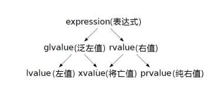

在C++中所谓的左值一般是指一个指向特定内存的具有名称的值（具名对象），它有一个相对稳定的内存地址，并且有一段较长的生命周期。

而右值则是不指向稳定内存地址的匿名值（不具名对象），它的生命周期很短，通常是暂时性的。

<!-- more -->

基于这一特征，我们可以用取地址符&来判断左值和右值，能取到内存地址的值为左值，否则为右值。

```c++
int x = 1;

int get_val()
{
  return x;
}

void set_val(int val)
{ 
  x = val;
}

int main() 
{
  x++;
  ++x;
  int y = get_val();
  set_val(6);
}
```

x++和++x虽然都是自增操作，但是却分为不同的左右值。其中x++是右值，因为在后置++操作中编译器首先会生成一份x值的临时复制，然后才对x递增，最后返回临时复制内容。而++x则不同，它是直接对x递增后马上返回其自身，所以++x是一个左值。

get\_val函数返回了一个全局变量x，虽然很明显变量x是一个左值，但是它经过函数返回以后变成了一个右值。原因和x++类似，在函数返回的时候编译器并不会返回x本身， 而是返回x的临时复制。

set\_val函数，该函数接受一个参数并且将参数的值赋值到x中。在main函数中set\_val(6);实参6是一个右值，但是进入函数之后形参 val却变成了一个左值，我们可以对val使用取地址符，并且不会引起任何问题

最后强调的是，字面量通常是右值，但是字符串字面量不是。编译器会将字符串字面量存储到程序的数据段中，程序加载的时候也会 为其开辟内存空间，所以我们可以使用取地址符&来获取字符串字面量 的内存地址。&#x20;

# 左值引用

左值引用使得C++在一定程度上脱离了危险的指针。当我们需要将一个对象作为参数传递给函数的时候，往往会使用左值引用，因为这样可以免去创建临时对象的操作。

此外，常量左值引用还可以引用右值，延长右值的生命周期。

```c++
class X
{
public:
    X() {}
    X(const X &) {}
    X &operator=(const X &) { return *this; }
};
X make_x()
{
    return X();
}
int main()
{
    X x1;
    X x2(x1);
    X x3(make_x());
    x3 = make_x();
}

```

常量左值引用可以绑定右值是一条非常棒的特性，但是因为他是常量，所以无法对他进行修改。因此，我们需要另一特性——右值引用

# 右值引用及其带来的性能优化

右值引用，顾名思义就是一种只能引用右值的方法，可以对比左值引用

```c++
int i = 0; 
int &j = i; // 左值引用 
int &&k = 11; // 右值引用
```

右值引用的特点之一是可以延长右值的生命周期，就像这样：

```c++
class X
{
public:
    X() { std::cout << "X ctor" << std::endl; }
    X(const X &x) { std::cout << "X copy ctor" << std::endl; }
    ~X() { std::cout << "X dtor" << std::endl; }
    void show() { std::cout << "show X" << std::endl; }
};
X make_x()
{
    X x1;
    return x1;
}
int main()
{
    X &&x2 = make_x();
    x2.show();
}

```

如果将X &\&x2 = make\_x() 这句代码替换为X x2 = make\_x()会发生三次构造。

1. make\_x函数中x1会默认构造

2. return x1会使用复制构造产生临时对象

3. X x2 = make\_x() 会使用复制构造将临时对象复制到x2

而使用右值引用就只进行了两次构造。

1. make\_x函数中x1的默认构造

2. 第二次是return x1引发的复制构造。

不同的是，由于x2是一个右值引用，引用的对象是函数make\_x返回的临时对象，因此该临时对象的生命周期得到延长，所以我们可以 在X &\&x2 = make\_x()语句结束后继续调用show函数而不会发生任何问题。


但是右值引用的最终目的并非延长临时对象的生命周期，而是减少复制的次数，提升程序性能。

```c++
class BigMemoryPool
{
public:
    static const int PoolSize = 4096;
    BigMemoryPool() : pool_(new char[PoolSize]) {}
    ~BigMemoryPool()
    {
        if (pool_ != nullptr)
        {
            delete[] pool_;
        }
    }
    BigMemoryPool(const BigMemoryPool &other) : pool_(new char[PoolSize])
    {
        std::cout << "copy big memory pool." << std::endl;
        memcpy(pool_, other.pool_, PoolSize);
    }

private:
    char *pool_;
};
BigMemoryPool get_pool(const BigMemoryPool &pool)
{
    return pool;
}
BigMemoryPool make_pool()
{
    BigMemoryPool pool;
    return get_pool(pool);
}
int main()
{
    BigMemoryPool my_pool = make_pool();
}
```

这段代码虽然是正确的，但是调用了3次复制构造函数。每一次复制都需要4KB的数据，开销较大。如果数据体积更大，对程序带来的影响也更大。

第2、3次都是影响性能的主要原因

> 因为有临时对象，临时对象本身只是复制。

因此，如果能直接转移其内存，就能消除复制的开销。于是我们可以使用移动语义来进行内存的转移。

```c++
class BigMemoryPool
{
public:
    static const int PoolSize = 4096;
    BigMemoryPool() : pool_(new char[PoolSize]) {}
    ~BigMemoryPool()
    {
        if (pool_ != nullptr)
        {
            delete[] pool_;
        }
    }
    // 右值引用类型
    BigMemoryPool(BigMemoryPool &&other)
    {
        std::cout << "move big memory pool." << std::endl;
        pool_ = other.pool_;
        other.pool_ = nullptr;
    }
    BigMemoryPool(const BigMemoryPool &other) : pool_(new char[PoolSize])
    {
        std::cout << "copy big memory pool." << std::endl;
        memcpy(pool_, other.pool_, PoolSize);
    }

private:
    char *pool_;
};
```

# 值类别

C++11标准中新引入的概念，将表达式分为3个类别是左值（lvalue）、纯右值（prvalue）和将亡值（xvalue）



左值是具名对象，可以被取地址、有持久状态的对象。

纯右值是没有身份的临时值，通常是表达式计算的结果，没有对应的内存地址。

将亡值则是表示一个有身份但其资源可以被重复使用或移动的对象。

将亡值的产生一般有两种

1. `static_cast`来换将泛左值转换为该类型的右值引用

2. C++17引入的，纯右值转换到临时对象，这个临时对象就是将亡值

# 左值转为右值

上文提到，我们可以把左值转换为将亡值来将其变为一个右值，从而进行右值引用。

但是建议通过`std::move`进行转换，而非`static_cast`，这样子可读性更好（虽然`std::move`内部也是用static\_cast做类型转换）。一般用于右值转换为左值之后，需要重新转换为右值的情况

# 万能引用与引用折叠

常量左值引用既可以引用左值又可以引用右值，是一个几乎万能的引用，但是因为它是个常量，所以使用起来很受限。

真正的万能引用可以这么写：

```c++
template <class T>
void bar(T &&t) {}    // t为万能引用

auto &&y = get_val(); // y为万能引用
```

不难发现，所谓的万能引用就是因为发送了类型推导。在这个推导过程中，初始化的源对象如果是一个左值，则目标对象会推导出左值引用；反之如果源对象是一个右值，则会推导出右值引用，不过无论如何都会是一个引用类型。

而之所以万能引用如此灵活，就是因为C++11中添加了一套引用叠加推导的规则——引用折叠。

| T模板型 | T实际类型 | 最终类型 |
| ---- | ----- | ---- |
| T&   | R     | R&   |
| T&   | R&    | R&   |
| T&   | R&&   | R&   |
| T&&  | R     | R&&  |
| T&&  | R&    | R&   |
| T&&  | R&&   | R&&  |

此外，万能引用的形式必须是T&&或者auto&&，也就是说它们必须在初始化的时候被直接推导出来，如果在推导中出现中间过程，则不是一个万能引用。

```c++
template <class T>
void foo(std::vector<T> &&t) {}
int main()
{
    std::vector<int> v{1, 2, 3};
    foo(v); // 编译错误
}
```

因为foo的形参类型是`std::vector<T>&&`而不是`T&&`，所以编译器无法将其看作一个万能 引用处理。&#x20;

# 完美转发

万能引用最典型的用途被称为完美转发。

现在先来看看传统的转发：

```c++
template <class T>
void show_type(T t)
{
    std::cout << typeid(t).name() << std::endl;
}
template <class T>
void normal_forwarding(T t)
{
    show_type(t);
}
int main()
{
    std::string s = "hello world";
    normal_forwarding(s);
}

```

它虽然能完成字符串的转发任务，但是效率低下。所以我们要使用引用进行转发。但是单单使用左值引用不能完美符合我们的需求。因此，我们可以使用万能转发。无论传递的是左值还是右值都可以被转发，而且不会发生多余的临时复制。

```c++
template <class T>
void show_type(T t)
{
    std::cout << typeid(t).name() << std::endl;
}
template <class T>
void perfect_forwarding(T &&t)
{
    show_type(static_cast<T &&>(t));
}
std::string get_string()
{
    return "hi world";
}
int main()
{
    std::string s = "hello world";
    perfect_forwarding(s);
    perfect_forwarding(get_string());
}

```

和移动语义的情况一样，显式使用static\_cast类型转换进行转发不是一个便捷的方法。在C++11的标准库中提供了一个std::forward函数模板，在函数内部也是使用static\_cast进行类型转换，只不过使用std::forward转发语义会表达得更加清晰。

```c++
template <class T>
void perfect_forwarding(T &&t)
{
    show_type(std::forward<T>(t));
}
```